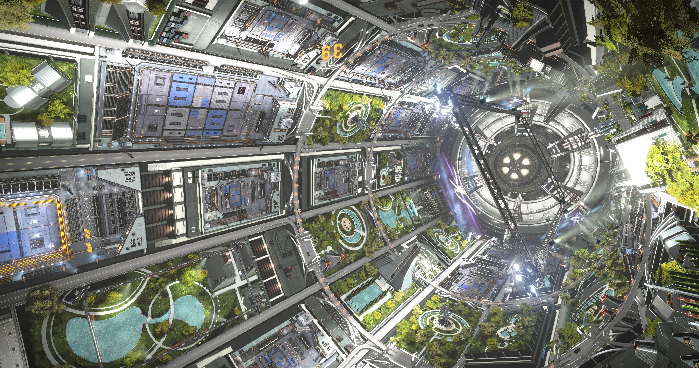

<!-- Improved compatibility of back to top link: See: https://github.com/othneildrew/Best-README-Template/pull/73 -->

<!--
*** Thanks for checking out the Best-README-Template. If you have a suggestion
*** that would make this better, please fork the repo and create a pull request
*** or simply open an issue with the tag "enhancement".
*** Don't forget to give the project a star!
*** Thanks again! Now go create something AMAZING! :D
-->

<!-- PROJECT SHIELDS -->
<!--
*** I'm using markdown "reference style" links for readability.
*** Reference links are enclosed in brackets [ ] instead of parentheses ( ).
*** See the bottom of this document for the declaration of the reference variables
*** for contributors-url, forks-url, etc. This is an optional, concise syntax you may use.
*** https://www.markdownguide.org/basic-syntax/#reference-style-links
-->
![GitHub Release][github-release-shield]
![GitHub Downloads (all assets, all releases)][github-downloads-shield]

<!-- PROJECT LOGO -->
 

  

  <h3 align="center">Elitist</h3>

  

    Another Elite: Dangerous Companion
  

<!-- ABOUT THE PROJECT -->
## About The Project

### The Idea
I've used (and still use) lots of companions and initially this is just my pet project. I wanted a simple informational companion to help me explore and do exobiology. The first iteration fo Elitist was larger and supposed to have way more features. But with features comes complexity and I'm limited by time. I quit Elite for quite some time, I keep coming back to it once every so often and enjoy the massiveness of it. 
i want this application to just be informational whilst exploring. Does the system I've now arrived in have bodies I should scan? How many signals are there and is the body worth landing on to analyse it's signals? Is it already explored? 

Nothing more initially, to keep the scope manageable and enjoying data in a way that I like consuming it.
There are vague plans to do more with materials for when I need more engineering done and need to farm them, same goes for cargo and potentially just having a view of what I'm carrying, or have mined for example.

v0.6.2 is the first version I've actually test driven and everything seemed to work as expected, which gives me confidence in expanding the functionality and improving the readability. (I'm using a iPad as a 2nd screen, given I own a 49" monitor and have no second screen. The text is slightly small apparently ;))

(<a href="#readme-top">back to top</a>)

### Built With
[![Built-with-Electron][electron-shield]][electron-url]
![Build-with-Javascript][javascript-shield]
![Build-with-HTML5][html5-shield]

(<a href="#readme-top">back to top</a>)

<!-- CONTACT -->
## Contact

Cmdr Odylle - elitist-app@odylle.org

Project Link: [https://github.com/odylle/elitist.v2][project-url]

(<a href="#readme-top">back to top</a>)

<!-- MARKDOWN LINKS & IMAGES -->
<!-- https://www.markdownguide.org/basic-syntax/#reference-style-links -->
[project-url]: https://github.com/odylle/elitist.v2
[github-release-shield]: https://img.shields.io/github/v/release/odylle/elitist.v2?style=for-the-badge
[github-downloads-shield]: https://img.shields.io/github/downloads/odylle/elitist.v2/total?style=for-the-badge
[electron-shield]: https://img.shields.io/badge/Electron-FFFFFF?style=for-the-badge&logo=electron&logoColor=47848F&logoSize=auto&color=444444
[electron-url]: https://www.electronjs.org/
[javascript-shield]: https://img.shields.io/badge/Javascript-FFFFFF?style=for-the-badge&logo=javascript&logoColor=F7DF1E&logoSize=auto&color=444444
[html5-shield]: https://img.shields.io/badge/HTML5-FFFFFF?style=for-the-badge&logo=html5&logoColor=E34F26&logoSize=auto&color=444444
